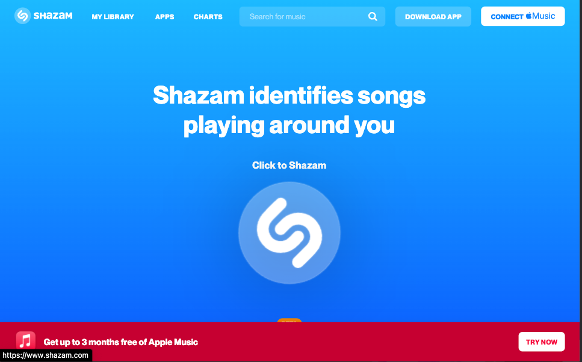

## Log in page or Sign in in

[Test this app yourself](https://maykaltenev.github.io/shazam-boostrap-clone/)

---

### About Project

This is a clone of the Shazam Webpage created with the Bootstrap framework. The page contain only the navbar, the top main part and the footer of the page.
 

##### Developed With

- [x] _HTML5_
- [x] _CSS3_
- [ ] _SASS_
- [ ] _SCSS_
- [x] _JavaScript_
- [ ] _React_
- [x] _Bootstrap_

---

### Contact

Mail: <michaeltenev@mail.com> 
GitHub: [michaeltenev](https://github.com/maykaltenev) 
LinkedIn: [Maykal Tenev](https://www.linkedin.com/in/maykal-tenev-a8729586/)

---

### Used Tools

- [npm](https://www.npmjs.com/)
- [Visual Studio Code](https://code.visualstudio.com/)

### Recourses

- [MDN Web Docs](https://developer.mozilla.org/de/)
- [Bootstrap](https://getbootstrap.com/)

---

Made with ❤️ by me
